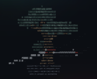

# The Sword Saint's Last Spring

> Three legendary swords. One crooked bonsai. A final lesson about what power is meant to protect.

A quiet, atmospheric reading experience built around a living bonsai rendered in the background. The page blends a glass interface, calligraphic type, drifting light, and a long-form story about restraint, memory, and new growth.

<p align="center">
  
</p>

## The Experience

The opening view places the Sword Saint's three legendary blades beside the bonsai that came to mean more to him than victory. The tree is rendered as an animated point cloud behind the glass panels, while the page itself leads naturally into the story.

The story reader is part of the same page. Select **Read the story** to move from the opening scene into the complete tale.

## Project Layout

```text
.
├── index.html          # The story page and page structure
├── image.png           # Favicon and project artwork
├── css/
│   └── style.css       # Glass styling, type, layout, and responsive rules
└── js/
    └── main.js         # Bonsai and sword renderer, motion, and pointer interaction
```

## Run It

No build step is required. Open `index.html` directly in a browser, or serve the folder locally:

```bash
python3 -m http.server 8000
```

Then visit <http://localhost:8000>.

A local server is useful when checking browser behavior and keeps asset paths consistent with a deployed site.

## Design Notes

- **Glass:** translucent panels, soft borders, and cursor-lit surfaces
- **Tree:** a depth-sorted character renderer made from points, branches, leaves, soil, and a pot
- **Swords:** three moving forms that circle the scene as a quiet reminder of the Saint's past
- **Type:** Spectral for the story, Ma Shan Zheng for the brush lettering, and JetBrains Mono for the small interface labels
- **Responsive layout:** the story card and controls contract for narrow screens, with buttons stacking on mobile
- **Motion preference:** reduced-motion settings are respected by the renderer and atmospheric background

## Rights

The visual template and supporting implementation are available for reuse under the terms in [LICENSE](LICENSE).

The story **The Sword Saint's Last Spring**, its title, wording, characters, setting, names, themes, and story-specific creative expression are reserved by the author. They are not included in the template reuse permission.

See [LICENSE](LICENSE) before copying, adapting, publishing, or redistributing any part of this project.
